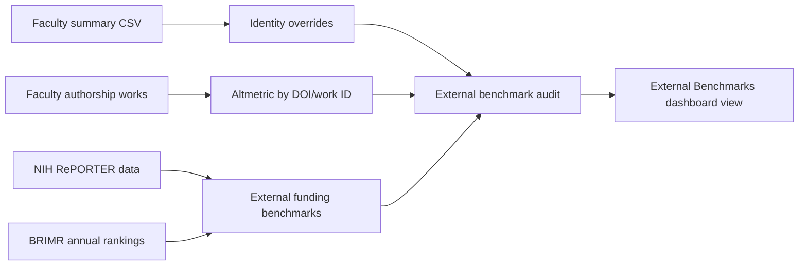

# feat: Add external benchmark data layers

## Summary

Add a V1 external-benchmark layer to the Rush research dashboard that extends the existing OpenAlex/NIH strategy data with three high-value sources: manual faculty identity overrides, Altmetric/attention data by DOI, and BRIMR/NIH funding benchmarks. ClinicalTrials.gov leadership and patent/innovation data are intentionally deferred so the first implementation improves dataset cleanliness and directly supports the research working group strategy discussion.

---

## Problem Frame

The current dashboard already summarizes Rush faculty bibliometrics, authorship roles, OpenAlex topics, team science, and NIH RePORTER-linked funding. The next strategic question is how to compare Rush against external research-ranking signals without duplicating Bharat's working group work or weakening the current dataset with uncertain joins.

The plan should keep JC's OpenAlex-generated faculty dashboard as the bibliometric layer, add external benchmark files as separate auditable data products, and preserve caveats when source access is partial or manually curated.

---

## Requirements

- R1. Add a durable identity override table so known OpenAlex split-profile and wrong-person cases can be audited without hard-coding corrections in scripts.
- R2. Add an Altmetric/attention import layer keyed by DOI and OpenAlex work ID, treating attention as visibility/translation rather than research quality.
- R3. Add BRIMR/Blue Ridge and external NIH funding benchmark tables for institution/department strategy comparisons.
- R4. Add dashboard views that show external benchmarks beside existing strategy metrics without replacing current faculty rankings.
- R5. Add quality audits that validate join keys, duplicate safety, source caveats, and aggregation reconciliation.
- R6. Preserve the existing `data/rush_researcher_h_index.csv` as the primary faculty summary table and only add columns when needed for dashboard display.
- R7. Keep ClinicalTrials.gov and patents out of V1 implementation, but leave the data model open for a later phase.

---

## Scope Boundaries

- Do not use Google Scholar or Altmetric to overwrite OpenAlex h-index, citation count, authorship-role, or works-count metrics.
- Do not auto-merge OpenAlex author profiles unless a row-level override explicitly marks the profile relationship as high-confidence.
- Do not require a paid Altmetric API key for V1; support CSV import first, then optional API fetch if credentials are available.
- Do not scrape BRIMR pages in a brittle way if downloadable annual data is available; prefer stable source files checked into `data/`.
- Do not add ClinicalTrials.gov or PatentsView data in V1.
- Do not create a new frontend framework; continue with the existing static `index.html` plus generated embedded data pattern.

### Deferred to Follow-Up Work

- ClinicalTrials.gov leadership layer: future phase with `data/clinical_trials.csv` and `data/faculty_clinical_trials.csv`.
- Patent/innovation output layer: future phase with `data/faculty_patents.csv`.
- Fully manual OpenAlex publication-level merge tooling: future hardening phase after the override table proves useful.

---

## Context & Research

### Relevant Code and Patterns

- `scripts/enrich_strategy_metrics.py` already fetches NIH RePORTER project data and writes generated data files under `data/`.
- `scripts/update_dashboard_raw.py` embeds CSV-derived constants into `index.html`.
- `scripts/audit_authorship_quality.py` and `scripts/audit_strategy_metrics.py` provide the existing audit pattern: JSON summary plus CSV flags, with blockers separated from review caveats.
- `index.html` is the current static dashboard, using generated JavaScript constants and Plotly charts.
- The current worktree contains an uncommitted Carlos A. Q. Santos split-profile audit. V1 should generalize that type of finding into an override table rather than relying only on free-text `match_type`.

### External References

- NIH RePORTER API exposes project and publication search, supports fiscal-year and organization-name criteria, and recommends no more than one URL request per second.
- BRIMR/Blue Ridge methodology pages document annual NIH funding-ranking assumptions and should be treated as benchmark context rather than faculty-level truth.
- Altmetric describes the Altmetric Attention Score as weighted attention across online sources; V1 dashboard language must call it attention/visibility, not quality.
- ClinicalTrials.gov API and USPTO PatentsView are relevant future sources, but they are deferred from V1.

---

## Key Technical Decisions

- Use CSV-first ingestion for new external datasets: this lets JC/Bharat/Kumar exchange files by email or shared drive without requiring API credentials during initial implementation.
- Add one optional API path only where the repo already has a stable pattern: NIH RePORTER can continue through `scripts/enrich_strategy_metrics.py` or a new external benchmark script because the current repo already calls NIH RePORTER.
- Treat Altmetric as work-level metadata keyed by DOI and OpenAlex work ID; faculty and department summaries should aggregate from `data/faculty_authorship_works.csv`, not from name matching.
- Represent identity caveats in `data/faculty_identity_overrides.csv` with explicit status values such as `confirmed_primary`, `split_profile_review`, `wrong_person`, and `do_not_merge`.
- Keep BRIMR rankings separate from Rush department labels until an explicit crosswalk maps BRIMR categories to dashboard departments.
- Add an "External Benchmarks" dashboard section/tab that compares attention and funding context while keeping existing Leadership Lens and Strategy Metrics intact.

---

## Open Questions

### Resolved During Planning

- V1 scope: identity overrides, Altmetric import, and BRIMR/NIH funding benchmarks.
- ClinicalTrials.gov and patents: defer to a later phase.
- Altmetric source mode: import-first, optional API later.

### Deferred to Implementation

- Exact Altmetric export schema: depends on whether Rush has Altmetric/Dimensions access and what CSV fields are available.
- Exact BRIMR source file shape: depends on whether implementation uses downloadable data, manual export, or a normalized hand-curated file.
- Final comparator institutions: start with source data support; allow a small local config/list if the working group wants specific peers.

---

## Output Structure

    data/
      faculty_identity_overrides.csv
      work_altmetrics.csv
      external_funding_benchmarks.csv
      brimr_department_rankings.csv
      external_benchmark_report.json
      external_benchmark_quality_audit.json
      external_benchmark_quality_flags.csv
    scripts/
      apply_identity_overrides.py
      enrich_external_benchmarks.py
      audit_external_benchmarks.py
    docs/
      audits/
        external-benchmark-data-audit-YYYY-MM-DD.md

---

## High-Level Technical Design

> *This illustrates the intended approach and is directional guidance for review, not implementation specification. The implementing agent should treat it as context, not code to reproduce.*

---

## Implementation Units

### U1. Add Faculty Identity Override Layer

**Goal:** Create a durable, auditable way to record faculty identity corrections and OpenAlex split-profile caveats.

**Requirements:** R1, R5, R6

**Dependencies:** None

**Files:**
- Create: `data/faculty_identity_overrides.csv`
- Create: `scripts/apply_identity_overrides.py`
- Modify: `scripts/audit_authorship_quality.py`
- Modify: `data/rush_researcher_h_index.csv`
- Test: `scripts/audit_external_benchmarks.py`

**Approach:**
- Define override rows with faculty name, department, primary OpenAlex ID, alternate OpenAlex IDs, ORCID, Google Scholar URL, status, confidence, source URLs, and notes.
- Move the Carlos A. Q. Santos split-profile finding into the override table as the first real row.
- Keep the current primary OpenAlex ID unless the override status explicitly says a replacement is high-confidence.
- Update authorship audit logic so `split_profile_review` and similar override statuses appear as review caveats.

**Patterns to follow:**
- Existing blocker/review split in `scripts/audit_authorship_quality.py`.
- Existing source-caveat language in `docs/audits/carlos-santos-openalex-profile-audit-2026-05-15.md`.

**Test scenarios:**
- Happy path: Carlos Santos override row is present and the audit emits one review caveat without changing the primary OpenAlex ID.
- Edge case: override row names an alternate OpenAlex ID but no primary ID change; dashboard metrics remain based on the primary ID.
- Error path: duplicate override rows for the same faculty/dept/status produce an audit blocker.
- Integration: running the identity override script and then the authorship audit preserves zero duplicate OpenAlex IDs and zero faculty-work reconciliation mismatches.

**Verification:**
- `data/faculty_identity_overrides.csv` exists with Carlos Santos represented.
- Authorship audit still has zero blockers.
- The dataset clearly distinguishes high-confidence replacements from split-profile review caveats.

---

### U2. Add Altmetric / Public Attention Import

**Goal:** Add work-level attention data keyed by DOI/OpenAlex work ID and aggregate it to faculty and department strategy views.

**Requirements:** R2, R4, R5, R6

**Dependencies:** U1

**Files:**
- Create: `data/work_altmetrics.csv`
- Modify: `scripts/enrich_external_benchmarks.py`
- Modify: `scripts/update_dashboard_raw.py`
- Modify: `index.html`
- Test: `scripts/audit_external_benchmarks.py`

**Approach:**
- Support CSV import with fields for DOI, work ID, Altmetric Attention Score, news mentions, policy mentions, social/media mentions, Mendeley readers, source, and last checked date.
- Join Altmetric rows to `data/faculty_authorship_works.csv` by DOI first and OpenAlex work ID second.
- Aggregate to faculty and department using existing faculty-work rows so multi-faculty works remain traceable.
- Add dashboard copy that labels these as "attention", "visibility", or "translation reach", not scientific quality.

**Patterns to follow:**
- Work-level generated data pattern from `data/work_strategy_metrics.csv`.
- Dashboard source note and caveat style in the Strategy Metrics tab.

**Test scenarios:**
- Happy path: a DOI in `work_altmetrics.csv` joins to one or more faculty-work rows and contributes to faculty and department attention totals.
- Edge case: a DOI appears more than once with the same source; audit flags duplicate DOI/source rows.
- Edge case: a work has no DOI but has an OpenAlex work ID; the OpenAlex work ID join succeeds.
- Error path: Altmetric score is nonnumeric or negative; audit flags a blocker.
- Integration: dashboard External Benchmarks view renders top attention works and department attention summaries without changing h-index or authorship metrics.

**Verification:**
- Work-level Altmetric file is loaded into embedded dashboard data.
- Audit reports matched and unmatched Altmetric rows.
- Existing faculty rankings remain unchanged except for new attention fields if added.

---

### U3. Add BRIMR / External Funding Benchmark Tables

**Goal:** Add external funding benchmark data that helps compare Rush departments and institutional performance against NIH-ranking strategy signals.

**Requirements:** R3, R4, R5, R6

**Dependencies:** U1

**Files:**
- Create: `data/brimr_department_rankings.csv`
- Create: `data/external_funding_benchmarks.csv`
- Modify: `scripts/enrich_external_benchmarks.py`
- Modify: `scripts/update_dashboard_raw.py`
- Modify: `index.html`
- Test: `scripts/audit_external_benchmarks.py`

**Approach:**
- Store BRIMR rows by year, organization, BRIMR category, rank, total NIH funding, peer count, and source URL.
- Store external funding benchmark rows for Rush and selected comparator institutions by year, source, organization, department/category, NIH dollars, rank, active projects, R01 count, and notes.
- Add a small department/category crosswalk only when the mapping is explicit; otherwise show BRIMR category labels separately from Rush department labels.
- Reuse existing NIH RePORTER project data for Rush internal counts and use BRIMR/external files for external rank context.

**Patterns to follow:**
- Existing NIH RePORTER aggregation in `scripts/enrich_strategy_metrics.py`.
- Existing department-level generated constants in `scripts/update_dashboard_raw.py`.

**Test scenarios:**
- Happy path: Rush benchmark row appears with year, rank, NIH dollars, source URL, and renders in the dashboard.
- Edge case: BRIMR category has no matching Rush department; dashboard shows it as category-level benchmark rather than forcing a false department join.
- Error path: duplicate benchmark rows for the same source/year/org/category produce an audit blocker.
- Integration: external benchmark dashboard can show Rush internal NIH counts beside external benchmark ranks without double-counting existing NIH RePORTER awards.

**Verification:**
- External funding files exist and pass schema checks.
- Department/category crosswalk caveats are reported.
- Dashboard shows external rank/funding context without replacing current Strategy Metrics values.

---

### U4. Add External Benchmark Dashboard View

**Goal:** Add a user-facing dashboard view for identity caveats, attention metrics, and external funding benchmarks.

**Requirements:** R2, R3, R4, R5

**Dependencies:** U2, U3

**Files:**
- Modify: `index.html`
- Modify: `scripts/update_dashboard_raw.py`
- Test: `scripts/audit_external_benchmarks.py`

**Approach:**
- Add a new "External Benchmarks" tab or section after Strategy Metrics.
- Include KPI cards for DOI attention coverage, top attention works, BRIMR/funding benchmark coverage, and identity caveats requiring review.
- Add charts/tables for top Altmetric works, department attention summaries, Rush/peer funding benchmarks, and identity-review queue.
- Use methodology notes to separate "attention", "funding rank", and "faculty bibliometrics".

**Patterns to follow:**
- Existing KPI grid, chart-card, table, and source-note conventions in `index.html`.
- Existing first/last authorship caveat wording style.

**Test scenarios:**
- Happy path: External Benchmarks tab renders with populated attention and funding data.
- Edge case: no Altmetric import file is present; tab renders a clear "no imported attention data yet" state without JavaScript errors.
- Edge case: no BRIMR rows are present; funding benchmark section shows source-missing state while NIH internal metrics still render.
- Integration: browser QA confirms no console errors, no horizontal overflow, and clear labels on desktop and mobile.

**Verification:**
- Dashboard renders existing tabs unchanged.
- External Benchmarks view is visually inspectable on desktop and mobile.
- Labels do not imply Altmetric equals quality or BRIMR equals faculty-level performance.

---

### U5. Add External Benchmark Quality Audit and Final Evidence

**Goal:** Add release gates for the new benchmark data and produce durable audit evidence.

**Requirements:** R5, R6

**Dependencies:** U1, U2, U3, U4

**Files:**
- Create: `scripts/audit_external_benchmarks.py`
- Create: `data/external_benchmark_quality_audit.json`
- Create: `data/external_benchmark_quality_flags.csv`
- Create: `data/external_benchmark_report.json`
- Create: `docs/audits/external-benchmark-data-audit-YYYY-MM-DD.md`

**Approach:**
- Audit schemas, duplicate keys, join coverage, numeric ranges, required source URLs, and unmatched records.
- Classify issues as blockers when they corrupt metrics or joins, and review caveats when they reflect missing external data or source access limitations.
- Summarize Altmetric coverage by DOI/work ID, BRIMR/funding benchmark coverage by year/category, and identity override status counts.

**Patterns to follow:**
- Existing audit JSON/CSV pattern in `scripts/audit_strategy_metrics.py`.
- Existing final audit note format in `docs/audits/final-dashboard-audit-2026-05-15.md`.

**Test scenarios:**
- Happy path: valid override, Altmetric, and funding benchmark rows produce zero blockers.
- Error path: duplicate DOI rows, duplicate benchmark keys, invalid numeric fields, or missing required source URLs produce blockers.
- Review path: unmatched DOI, missing BRIMR category crosswalk, and split-profile identity caveats produce review flags.
- Integration: all new audit outputs reconcile to dashboard embedded constants.

**Verification:**
- New audit exits successfully only when blockers are zero.
- Audit note lists sources, coverage, caveats, and non-goals.
- Existing authorship and strategy audits still pass.

---

## System-Wide Impact

- **Data pipeline:** Adds external benchmark data beside existing OpenAlex/NIH generated outputs; does not replace current primary metrics.
- **Dashboard:** Adds one new view and new embedded constants while preserving existing tab behavior.
- **Audit posture:** Expands the existing zero-blocker release gate to include external benchmark data.
- **Collaboration:** Creates clear input files that Bharat/Kumar's working group can help fill without editing the core faculty summary manually.
- **Source limitations:** Makes paid/blocked sources visible as caveats rather than silently treating missing data as zero impact.

---

## Risks & Dependencies

| Risk | Mitigation |
|------|------------|
| Altmetric access may require institutional credentials | Make CSV import the V1 path and API fetch optional. |
| Altmetric can be misread as quality | Use "attention" and "visibility" wording throughout dashboard and docs. |
| BRIMR categories may not map cleanly to Rush departments | Keep category labels separate unless an explicit crosswalk exists. |
| Identity overrides can accidentally overwrite valid profiles | Require explicit status/confidence before primary OpenAlex ID replacement. |
| Existing Carlos Santos dirty changes could mix with benchmark work | Resolve or carry them into U1 before starting the new benchmark implementation. |
| External source data can drift annually | Store year, source URL, last checked date, and audit report for every imported benchmark row. |

---

## Documentation Plan

- Add a final audit note under `docs/audits/` after implementation.
- Update dashboard methodology text to explain Altmetric, BRIMR, and identity override caveats.
- Document CSV import expectations in comments or a short section in the audit note rather than adding a broad README rewrite.

---

## Success Metrics

- External benchmark audit reports zero blockers.
- Authorship and strategy audits continue to report zero blockers.
- Carlos Santos and future split-profile cases are visible through the override table and audit flags.
- Dashboard renders the External Benchmarks view without console errors on desktop and mobile.
- Working group users can distinguish faculty bibliometrics, funding benchmarks, and attention metrics without conflating them.

